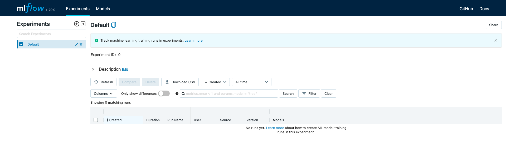

# AIRFLOW_MLFLOW_DOCKER

## Background
The goal of this project is to create an ecosystem where to run **Data Pipelines** and monitor **Experiments**.

## Getting started

### Docker
Create `docker-compose.yaml` which is responsible for running `Airflow` components, each on a different container:
* airflow-webserver
* airflow-scheduler
* airflow-worker
* airflow-triggerer

From terminal, run the following command to start Airflow on port 8080:
```
docker compose up -d
```

### Airflow
After running docker container, visit the page: `localhost:8080`


And log into the Airflow world!

Populate the `dags` folder with all the DAGS needed for the project.


### MLFlow
On the `docker-compose.yaml` includes the `mlflow` container in the `services` section.
This container is responsible for running the `MLFlow server` exposed on the `localhost:600`.


Open the `example_dag.py` and set the URI of the current MLFlow server(localhost:600)
```
mlflow.set_tracking_uri('http://mlflow:600')
```

After updating the URI of the MLFlow server, create a new connection on `Airflow`.

### Tech Stack
* Airflow
* MLflow
* Docker
* Python


### References
* [Airflow Docker](https://airflow.apache.org/docs/apache-airflow/stable/howto/docker-compose/index.html)