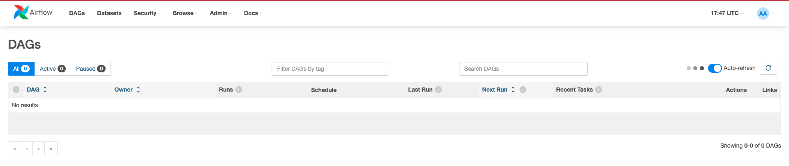

# AIRFLOW_MLFLOW_DOCKER

## Background
The goal of this project is to create an ecosystem where to run **Data Pipelines** and monitor **Experiments**.

## Getting started

### Docker
Create `docker-compose.yaml` which is responsible for running `Airflow` components, each on a different container:
* airflow-webserver
* airflow-scheduler
* airflow-worker
* airflow-triggerer

From terminal, run the following command to start Airflow on port 8080:
```
docker compose up -d
```

### Airflow

After running docker container, visit the page: `localhost:8080`


And log into the Airflow world!


### Tech Stack
* Airflow
* MLflow
* Docker
* Python


### References
* [Airflow Docker](https://airflow.apache.org/docs/apache-airflow/stable/howto/docker-compose/index.html)